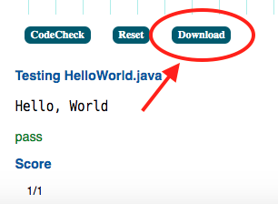

### Εργαστήριο #1 - Εισαγωγή στη Java, τη JVM και το JDK
___
Σκοπός του πρώτου εργαστηρίου είναι να εξοικειωθείτε με τη Java VM, το Java Development Kit στο περιβάλλον επεξεργασίας πηγαίου κώδικα IDE Atom ή στο GoormIDE.

___
#### Ασκήσεις ####
* Στο περιβάλλον codeckeck λύστε το Parsons puzzle `Hello World`:
    https://codecheck.io/files/2210040845ehutdcsp7wbjhky9u663v9xdx  
    * Όταν πετύχετε να κάνετε `compile` την κλάση:
        
        1. κάντε **Download** το αποτέλεσμα
        2. μετονομάστε το **στο αριθμητικό μέρος του ΑΜ σας** (πχ `2000123.zip`) και
        3. ανεβάστε το στη μη αξιολογούμενη εργασία της εβδομάδας **στο opencourses**
* Σε όποιο περιβάλλον δουλεύετε (desktop ή GoormIDE):
    * Κατεβάστε αυτό το repo για να έχετε τον κώδικά του (και να λαμβάνεται τον κώδικα των επόμενων εβδομάδων)
        * Προτείνεται να το κατεβάσετε εκτελώντας (_εντός του φακέλου που θα δουλεύετε!!_)  
        `git clone https://github.com/courses-ionio/java.git`  
        Αν η εντολή git δεν είναι εγκατεστημένη στο σύστημά σας:  
        https://www.atlassian.com/git/tutorials/install-git
        * Εναλλακτικά, κατεβάστε όλο το branch ως zip αρχείο (_..αλλά θα πρέπει κάθε εβδομάδα να κάνετε το ίδιο.. :-(_  ) από  
        https://github.com/courses-ionio/java/archive/refs/heads/master.zip
    * Μετακινηθείτε **από το τερματικό** σας στο φάκελο της πρώτης εβδομάδας `lab-java-1`
    * **Aπό το τερματικό** κάνετε `compile` και στη συνέχεια εκτελέστε την κλάση HelloWorld που βρίσκεται στο φάκελο `lab-java-1`.
    * **Στον editor** όποιου IDE χρησιμοποιείτε, μελετήστε τα σφάλματα του compiler για τις κλάσεις `HelloWorld_`(1,2,3 αντίστοιχα), διορθώστε τα (_στον editor_) και στη συνέχεια κάντε `compile` τις κλάσεις και εκτελέστε τες.
